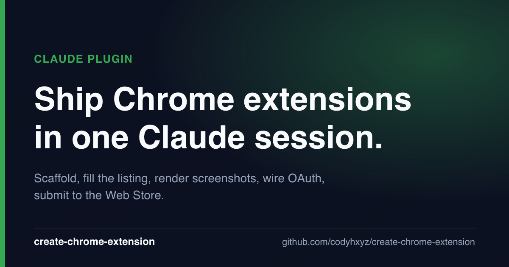

# create-chrome-extension

> A Claude Code plugin that ships your Chrome extension — scaffold, fill the listing, capture screenshots, set up OAuth, and submit to the Chrome Web Store, in one session.

[WXT](https://wxt.dev) + React 19 + Tailwind v4 + TypeScript. Six skills, one validator, one ship gate.

<p align="center">
  
</p>

## Before → After

> **Before:** "I have a Chrome extension idea and a vague memory that the Web Store has a bunch of rules I'll discover the night I try to ship."
>
> **After:** Extension scaffolded to your profile, structural validator green, listing copy + 5 screenshots + 30-second promo filled in, OAuth wired up, zip uploaded and polling. ~Half a day end-to-end.

## What you walk away with

- A working WXT extension matching your profile — content-script-only, popup, side panel, or full hybrid
- Listing copy, 5 screenshots, and a 30-second promo that pass the Chrome Web Store's content rules — encoded as validators in `scripts/validate-cws.ts`, not as vibes
- OAuth credentials wired so `npm run ship` does the build → version-sync → upload → poll for you
- A `check:cws:ship` gate that refuses to produce a zip until the listing is submission-ready

## Examples

**Scaffold a side-panel-style extension and strip the rest:**
```
> /create-chrome-extension:cce-init
```
Walks an interview about your concept → picks the matching profile (e.g. `side-panel-app`) → deletes the entrypoints you won't use → confirms `npm run check:cws` is green.

**Fill the listing and clear the four content rules:**
```
> /create-chrome-extension:cws-content
```
Interviews you for name, short description, host origins, welcome copy → writes `wxt.config.ts` and `entrypoints/welcome/config.ts` → re-runs the validator with the four content rules now active.

**Capture the five required Web Store screenshots:**
```
> /create-chrome-extension:cws-screens
```
Interviews for the five panel concepts → writes `screenshots/config.ts` → runs `npm run screenshots` to render 1280×800 PNGs from your live extension.

**Submit to the Web Store:**
```
> /create-chrome-extension:cws-ship
```
Gates on `npm run check:cws:ship` → version-syncs against the live listing → confirms with you → submits via the CWS API (or falls back to manual zip upload if you skipped OAuth).

## Install

### As a Claude Code plugin (recommended)

```
/plugin marketplace add codyhxyz/codyhxyz-plugins
/plugin install create-chrome-extension@codyhxyz-plugins
```

Or install directly from this repo:

```
/plugin marketplace add codyhxyz/create-chrome-extension
/plugin install create-chrome-extension@create-chrome-extension
```

The six skills (`cce-init`, `cws-content`, `cws-screens`, `cws-ship`, `cws-video`, `setup-cws-credentials`) appear under the `/create-chrome-extension:` namespace. Each one assumes you're running inside a cloned factory repo — see below.

### Scaffold a new extension via the CLI

```bash
npx create-chrome-extension my-extension
cd my-extension
# Open in Claude Code, run /create-chrome-extension:cce-init
```

### Or clone the factory manually

```bash
git clone https://github.com/codyhxyz/create-chrome-extension.git my-extension
cd my-extension
npm install
npm run dev
```

## Usage

Inside a freshly cloned factory repo, the canonical session is:

1. `/create-chrome-extension:cce-init` — interview, strip, confirm green
2. `/create-chrome-extension:cws-content` — fill the listing
3. `/create-chrome-extension:cws-screens` — render screenshots
4. `/create-chrome-extension:cws-video` — produce the 30-second promo (optional)
5. `/create-chrome-extension:setup-cws-credentials` — Google Cloud + OAuth (one-time)
6. `/create-chrome-extension:cws-ship` — version-sync, upload, poll

Each skill is independently invocable — re-run `cws-content` after a copy change, re-run `cws-screens` after a UI change, etc.

## Why this exists

The Chrome Web Store enforces ~18 content rules that aren't assembled in one place anywhere in Google's docs. The factory encodes them as validators (`npm run check:cws`, `npm run check:cws:ship`) so you can't accidentally ship a half-baked listing. The skills are the conversational layer over those validators — they interview you, write the right files, and re-run the checker.

**This plugin won't:** write your extension's actual feature code, design your UI, generate marketing screenshots that aren't grounded in your live extension, or submit to anywhere other than the Chrome Web Store.

## Architecture

A Chrome extension is a small distributed system: separate surfaces that can't share variables and only talk via typed messages.

```
┌───────────────────────────── CHROME BROWSER ──────────────────────────────┐
│                                                                            │
│   ┌──────────────┐     ┌────────────────┐     ┌───────────────────────┐  │
│   │  POPUP       │     │  OPTIONS PAGE  │     │  SIDE PANEL           │  │
│   │  (React+TW)  │     │  (React+TW)    │     │  (React+TW)           │  │
│   └──────┬───────┘     └────────┬───────┘     └───────────┬───────────┘  │
│          │                      │  typed messages         │              │
│          └──────────────────────┼─────────────────────────┘              │
│                                 ▼                                         │
│                        ┌────────────────────┐                             │
│                        │  BACKGROUND WORKER │  ←── alarms, storage,      │
│                        │  (service worker)  │      network, "the brain"  │
│                        └─────────┬──────────┘                             │
│                                  │ messages                               │
│                                  ▼                                        │
│   ┌─────────────────────────────────────────────────────────────────┐    │
│   │  ACTIVE WEB PAGE                                                │    │
│   │   ┌─────────────────┐         ┌──────────────────┐             │    │
│   │   │ Page DOM        │  ◄────  │ CONTENT SCRIPT   │             │    │
│   │   │ + Shadow DOMs   │         │ (vanilla TS)     │             │    │
│   │   └─────────────────┘         └──────────────────┘             │    │
│   └─────────────────────────────────────────────────────────────────┘    │
└───────────────────────────────────────────────────────────────────────────┘
```

Messaging is typed via `utils/messaging.ts` — TypeScript catches mismatched payloads at compile time.

## The Factory Idea

Start with everything; **delete what you don't need.**

```
   ┌──────────────┐    delete what     ┌──────────────┐
   │ Full hybrid  │ ─── you don't ───► │ Lean         │
   │ (everything) │     need           │ extension    │
   └──────────────┘                    └──────────────┘
```

Profiles: content-script-only, popup-based, side-panel app, full hybrid. See [docs/01-extension-type-profiles.md](docs/01-extension-type-profiles.md).

## Lifecycle

```
   1. CLONE          npx create-chrome-extension my-extension
        ▼
   2. STRIP          /create-chrome-extension:cce-init
        ▼
   3. DEV            npm run dev    → opens Chrome, HMR
        ▼
   4. BUILD          npm run build  → .output/chrome-mv3/
        ▼
   5. SCREENSHOTS    /create-chrome-extension:cws-screens → npm run screenshots
        ▼
   6. ZIP            npm run zip    → gated on check:cws:ship
        ▼
   7. SUBMIT         /create-chrome-extension:cws-ship
        ▼
   8. REVIEW         CWS review → live on store   ◄──┐
        ▼                                            │
   9. ITERATE        bug fixes / features ───────────┘  (back to DEV)
        ▼
  10. KEEPALIVE      GitHub Action auto-bumps + republishes every 4 months
                     so the listing doesn't go stale (opt-in via 4 secrets)
```

## Commands

| Command | Description |
|---------|-------------|
| `npm run dev` | Dev server with HMR (opens Chrome) |
| `npm run build` | Production build to `.output/chrome-mv3/` |
| `npm run zip` | Build + zip for CWS upload |
| `npm run compile` | TypeScript type check |
| `npm run check:cws` | CWS structural check (runs in CI) |
| `npm run check:cws:ship` | CWS submission-readiness gate (run before `zip`) |
| `npm run version-sync` | Compare local version to live CWS version (no-ops without CWS secrets) |
| `npm run ship` | End-to-end publish: `check:cws:ship` → `version-sync` → `wxt zip` → upload & poll |
| `npm run screenshots` | Render 1280×800 CWS screenshots from `screenshots/config.ts` |
| `npm run dev:firefox` | Dev server for Firefox |

## Docs

- [**Architecture**](ARCHITECTURE.md) — design philosophy, division of labor (scripts vs. skills), how to extend
- [**Roadmap**](ROADMAP.md) — planned implementation sessions for CWS API integration, skills, screenshots
- [Getting Started](docs/00-getting-started.md)
- [Extension Type Profiles](docs/01-extension-type-profiles.md)
- [Development Workflow](docs/02-development-workflow.md)
- [CWS Best Practices](docs/03-cws-best-practices.md) — rules the Chrome Web Store enforces but doesn't assemble in one place; includes submission mechanics
- [Security](docs/04-security.md)
- [Useful Patterns](docs/05-useful-patterns.md) — utilities, messaging, welcome page pattern
- [Keepalive Publish](docs/06-keepalive-publish.md)
- Templates: [Privacy Policy](docs/templates/privacy-policy.md) · [Store Listing](docs/templates/store-listing.md) · [QA Checklist](docs/templates/qa-checklist.md)
